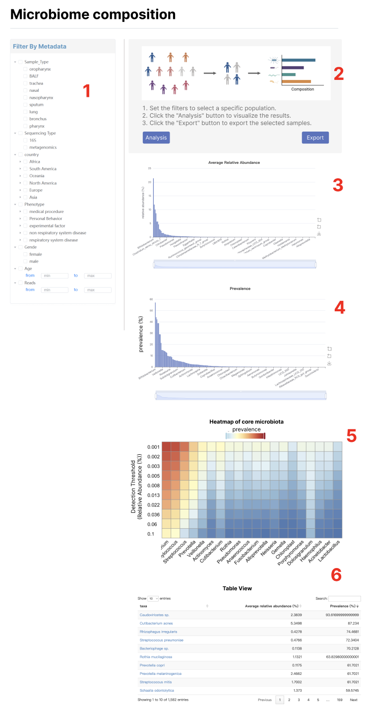
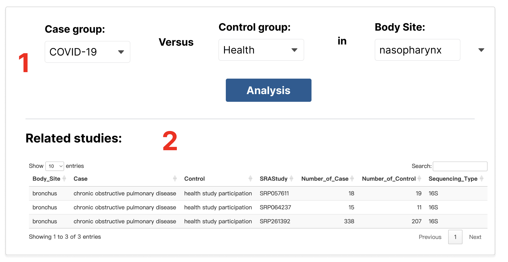
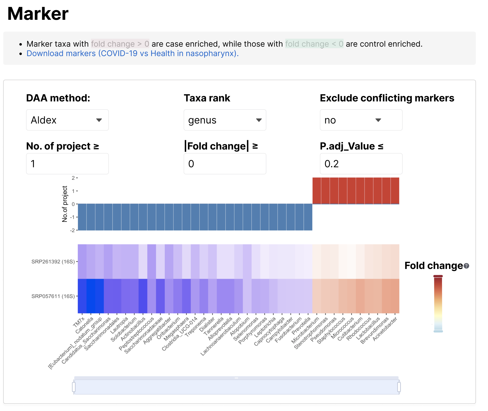
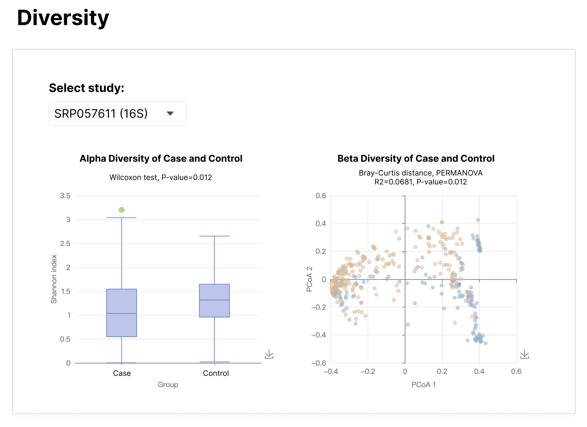
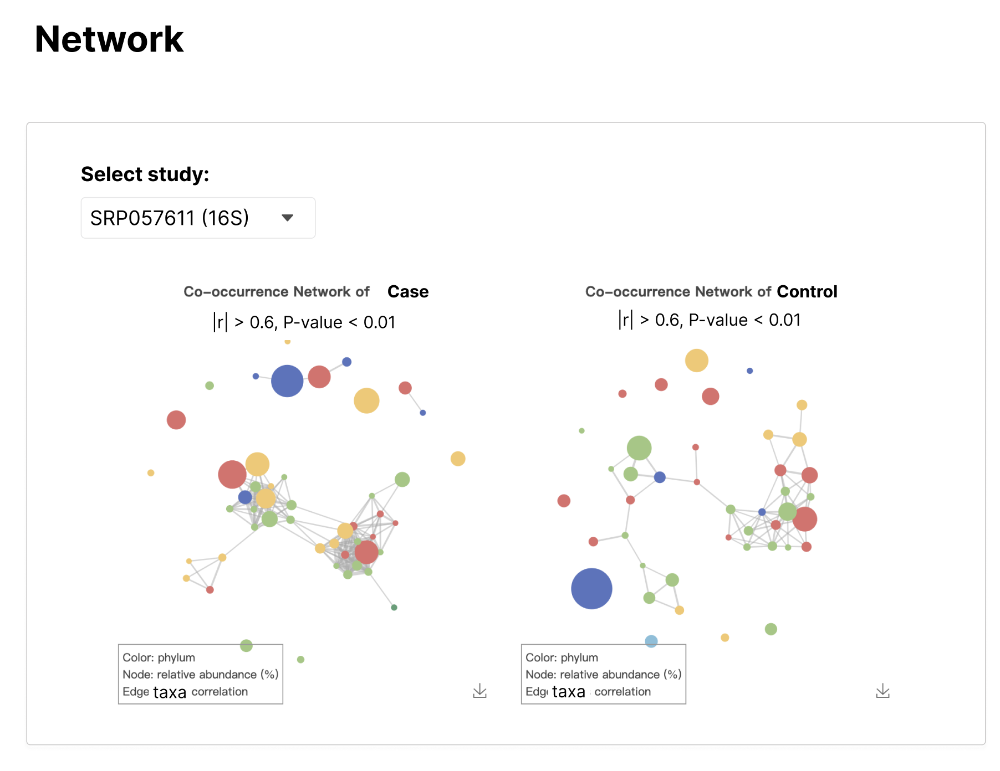

# Analysis

# Analysis-microbiome-composition



1.筛选样本，Body_Site（默认选nasopharynx）、Sequencing_Type（单选，默认选16S）、Phenotype（默认health study participation）、Country、Sex、Age（区间）、Reads（区间）

筛选年龄时，计算用的是Age_Estimate列，展示的是Age列

2.示意图：figure/microbiome-composition-sketch.png。按Analysis才开始进行分析，按Export，导出筛选的样本即subset_sample.txt

3-4.计算相对丰度和流行率abu_pre（见以下代码），分别对其画柱状图。（效果参考https://bioinfo.biols.ac.cn/mami/browse.php）

5.计算heatmap矩阵（见以下代码）

6.abu_pre的图表展示，第一列链接到对应的`Search-{taxa}，注意斜体。

```R
library(tidyverse)
# 提前导入
metadata = read_tsv("data/metadata.tsv") |> 
  filter(!is.na(Phenotype))
otu_all = read_rds("data/otu_all_nonzero.rds")

# 筛选样本
subset_sample = metadata |> 
  filter(Sequencing_Type == "16S",
         Body_Site == "nasopharynx",
         Phenotype == c("COVID-19"),
         Age_Estimate >1 & Age_Estimate <10,
         Reads > 5000) |> 
  pull(Run)
# 用户下载可以导出样本
write_lines(subset_sample,"subset_sample.txt")

# 计算平均相对丰度和流行率
num = length(subset_sample)
subset_otu = otu_all |> 
  filter(Run %in% subset_sample)
abu_pre = subset_otu |> 
  group_by(taxa) |> 
  summarise(`Average relative abundance (%)` = 100*round(sum(value)/num,4), 
            `Prevalence (%)`= 100*round(n()/num,4), .groups = 'drop') |> 
  arrange(desc(`Prevalence (%)`))

# 计算core microbiota heatmap
detections <- round(10^seq(log10(0.001), log10(.1), length = 10), 3)

toptaxa=abu_pre |> 
  arrange(desc(`Prevalence (%)`)) |> 
  slice_head(n = 20) |> 
  pull(taxa)

otu_sub = subset_otu |> 
  filter(taxa %in% toptaxa)

run_abu_pre = function(i){
  otu_sub |> 
    filter(value>i) |> 
    group_by(taxa) |> 
    summarise(pre=100*round(n()/num,6)) |> 
    mutate(abu_thre=i)
}

heatmap = purrr::map_dfr(detections, run_abu_pre) |> 
  pivot_wider(names_from = taxa,values_from = pre, values_fill = 0) |> 
  select(abu_thre,toptaxa) |> 
  column_to_rownames("abu_thre")
```

# Analysis-case-control-analysis



1.数据data/Downloads/case_control_study.tsv，下拉框筛选Case、Control、Body_Site。筛选一个框的同时，对另外一个框也做出限制。点击Analysis，返回表格cc.study_exam到Related studies，显示的列如图所示。同时记录cc.study_exam的CC_ID的值（唯一）。



2.数据data/marker.tsv。

筛选DAA_Method，过滤对应的过滤条件。需要对marker按照在不同研究富集的方向和个数进行排序。然后返回一个矩阵heatmap，矩阵上面的bar图记录每个marker在多少个队列中Fold_Change小于0和大于0。由于marker数量可能太多，下面加一个区域缩放。

Fold_Change后面的问号解释内容为：the mean of the differences between 0.1-0.9 quantiles of the logarithmic in two groups.

**！！这一部分比较复杂，可以多多讨论！！**

```r
marker_all=read_rds("data/marker.tsv")
cc.study = read_tsv("data/Downloads/case_control_study.tsv")

DAA_Method_value = "aldex" # 取值 "wilcox" ,"fastancom","ancombc","ancombc2","linda","aldex","maaslin2","zicoseq","wilcox.clr"
Rank_value = "genus" # 取值"genus","species"
conflict_value = "no" # 取值"yes","no"
n_project_thre = 1
Fold_Change_thre = 0
P.adj_Value_thre = 0.2 

cc.study_exam = cc.study|> 
  filter(Body_Site=="bronchus") |> 
  filter(Case=="chronic obstructive pulmonary disease") |> 
  filter(Control=="health study participation") |>  select(Body_Site,Case,Control,SRAStudy,Number_of_Case,Number_of_Control,Sequencing_Type,CC_ID)

marker.body = marker_all |> 
  filter(CC_ID==cc.study_exam$CC_ID[1]) |> 
  filter(Rank==Rank_value) |> # 过滤Taxa rank
  filter(DAA_Method==DAA_Method_value) |> # 过滤DAA_Method
  filter(abs(Fold_Change) >= Fold_Change_thre) |> # 过滤Fold_Change
  filter(P.adj_Value_thre <= P.adj_Value_thre) # 过滤P.adj_Value

marker_order = marker.body |> 
  group_by(Taxa) |> 
  summarise(positive=sum(Fold_Change>0),
            negative=-sum(Fold_Change<0),
            meanFC=mean(Fold_Change)) |> ungroup() |> 
  mutate(conflict=if_else(positive>0 & negative<0, "yes","no")) |> 
  filter(conflict == conflict_value) |> # 过滤conflict marker
  filter(positive>=n_project_thre | negative<=-n_project_thre) |> 
  arrange(positive+negative,meanFC)

heatmap = marker.body |> 
  filter(Taxa %in% marker_order$Taxa) |> 
  pivot_wider(Study_ID,names_from = Taxa,values_from = G_Fold_Change,values_fill = 0) |> 
  column_to_rownames("Study_ID") |> 
  select(marker_order$Taxa)
```



3.diversity。

数据data/diversity_alpha.tsv, data/diversity_beta.tsv, data/diversity_test.tsv。筛选CC_ID列为对应的CC_ID。

Select study筛选Study_ID列。

左图alpha diversity，数据diversity_alpha，分组为Case_Or_Control，boxplot分位数abu_min abu_q1 abu_median abu_q3 abu_max。检验p值在diversity_test的alpha_p_val。即`Wilcoxon test, P-value={diversity_test$alpha_p_val}`

右图beta diversity，数据diversity_beta，散点坐标PCoA1,PCoA2。分组染色Case_Or_Control。点的label为Run。检验文字为`R2=diversity_test$R2, P-value=diversity_test$beta_p_val`



4.network

数据：data/source2target_df.tsv, data/node_label_df.tsv。按照Case_Or_Control列画左右网络图case和control。筛选CC_ID列为对应的CC_ID。source2target_df为点的连边以及边的相关系数（有正负），node_label_df：所有的点taxa，点的大小value，点的颜色Phylum。

Select study筛选Study_ID列。

显示效果类似于https://bioinfo.ioz.ac.cn/mami/analysis.php的Network