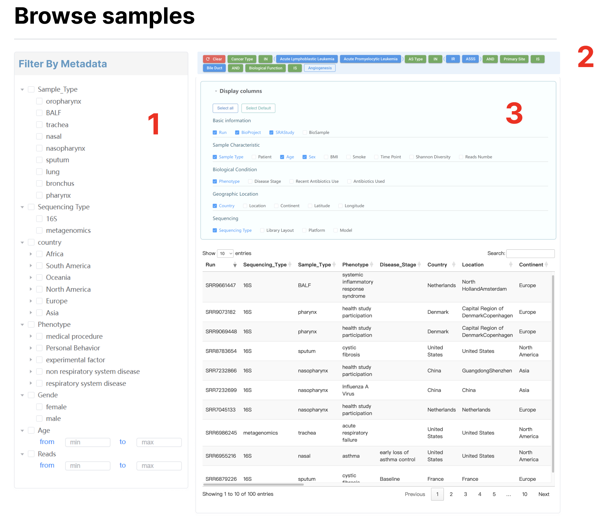

# Browse

# Browse-samples

对应data/metadata.tsv

1. 无视示意图筛选框。对metadata的行进行筛选，筛选框从上到下以此为Body_Site，Sequencing_Type，Phenotype(可以搜索)，Country(可以搜索)，Sex, Age（区间）, Reads（区间）。**！！筛选框具体如何设置，可以进一步讨论！！**
2. 显示筛选条件（效果类似于https://ngdc.cncb.ac.cn/ascancer/browse/knowledge?cancername=Acute%20Lymphoblastic%20Leukemia&page=1&size=13）
3. 展示列，效果类似于https://ngdc.cncb.ac.cn/gen/browse/datasets。

Display columns（加粗的为默认选择）

- Basic information
  - **Run**、**SRAStudy**、BioProject、BioSample

- Sample Characteristic
  - **Body_Site**（链接到对应的`browse-body-sites`）、Patient、**Age**、Age_Group、**Sex**、BMI、Smoke、Time_Point、Reads、Shannon、Observed、Chao1、Case_Or_Control、Is_Healthy

- Biological Condition
  - **Phenotype**（链接到对应的`browse-phenotype`）、Disease_Stage、Recent_Antibiotics_Use、Antibiotics_Used、

- Geographic Location
  - **Country**、Location、Continent、Latitude、Longitude

- Sequencing Strategy
  - **Sequencing_Type**、Library_Layout、Platform、Model

# Browse-studies

逻辑同上，数据对应data/studies.tsv

Filter By Metadata：Body_Site（链接到对应的`browse-body-sites`）、Sequencing_Type、Phenotype（链接到对应的`browse-phenotype`）、Country、Samples Number（区间）、With case and control

Display columns:**SRAStudy**、BioProject、**Sequencing_Type**、**Body_Site**、**Phenotype**、**Country**、**Samples Number**、With case and control、PMID、Average Reads Number

# Browse-publications

对应data/publication.tsv

PMID链接https://pubmed.ncbi.nlm.nih.gov/{PMID}/

DOI链接https://doi.org/{DOI}

Data Link链接https://www.ncbi.nlm.nih.gov/sra/?term={}

Phenotype链接到对应的`Browse-phenotype-{disease}`

Body_Site链接到`Browse-body-sites`

可能存在用；分割的并列，都要有链接

# Browse-markers

逻辑同上，数据对应data/marker.tsv

Filter By Metadata:Control、Case、Body_Site、Sequencing_Type、DAA_Method

Display columns:**Taxa**、**Body_Site**、**Case**、**Control**、**Fold_Change**、**Sequencing_Type**、P_Value、**P.adj_Value**、**DAA_Method**、AUROC、Prevalence_Shift、Number_of_Case、Number_of_Control、**Rank**

Fold_Change>0代表在Case组富集，对应Case列，染色#F9E8EC。Fold_Change<0代表在Control组富集，对应Control列，染色#D2EFE4。Case和Control，链接到`Browse-phenotype-{disease}`页面。

# Browse-phenotypes

对应data/phenotype.tsv

1. 指向`browse-phenotype-{disease}`
2. 指向`Browse-samples`，筛选对应的表型，如COVID-19
3. 指向`Browse-studies`，筛选对应的表型
4. 指向`Browse-publications`，筛选对应的表型
5. 指向`Browse-markers`，筛选对应的表型，并且Rank为genus
6. 指向`Browse-markers`，筛选对应的表型，并且Rank为species

### Browse-phenotype-disease

1. COVID-19的链接对应https://www.ebi.ac.uk/ols4/search?q={Phenotype_ID}。介绍对应data/phenotype.tsv的Description列。Number of related studies、Number of related samples、 Number of total publication分别对应data/phenotype.tsv的Nr. studies、Nr. samples、Nr. publications列的值。
2. 数据data/phenotype_marker.tsv，Nr. associated genus	Nr. associated species分别链接到指向`Browse-markers`，筛选对应的Case、Control、Body_Site，并且Rank为genus或species。Case-control analysis列链接`Analysis-case-control-analysis`页面，图标在figure/case-control-analysis.svg。
3. 数据data/phenotype_meta.tsv，Nr. runs链接到`Browse-samples`，Nr. studies链接到`Browse-studies`,Nr. publications链接到`Browse-publications` 。筛选对应的Phenotype和Body_Site。Microbiome composition列链接`Analysis-microbiome-composition`页面，图标在figure/microbiome-composition.svg。

# Browse-body-sites

1. 筛选对应的部位，部位后面的数字是metadata中Body_Site对应的数量。
2. 数据data/phenotype_meta.tsv，筛选Body_Site列。链接内容与`Browse-phenotype-disease`的一致。
3. 对应figure/body_site的{Body_Site}-{all/health/disease}.png