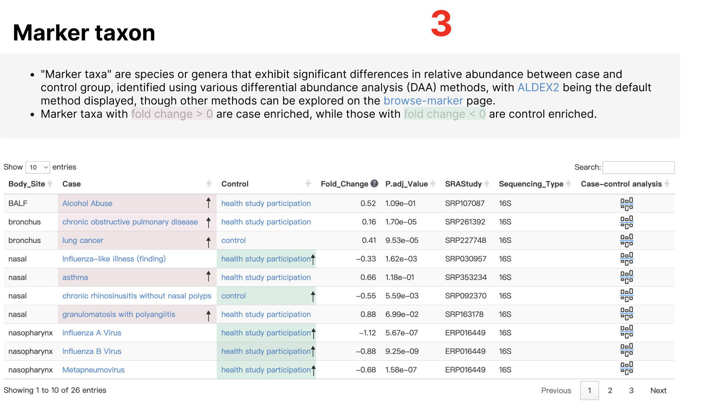
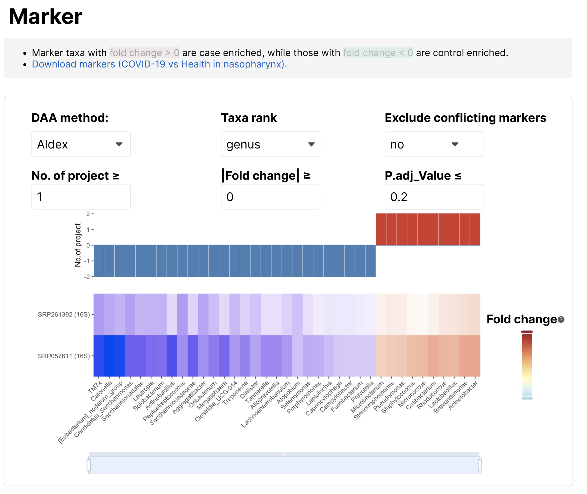

# Note

样本的metadata：data/metadata.tsv

导航栏logo对应figure对应svg，如Home:home.svg, Search:search.svg, Browse:browse.svg, Analysis: analysis.svg, Download: download.svg, Help:help.svg

微生物全部斜体

注意respiratory的拼写，之前我很多地方都拼错了，比如主页

# Home

## ResMicroDb


1. Logo:figure/logo.png

2. ResMicroDb对应颜色：#ECB35D，#82BAE4，#A7C9A7

3. 呼吸道部位图对应figure/body_sites.png

4. 部位-疾病健康分布对应data/body_site_distribution.tsv。case代表疾病disease，control代表健康health

   鼠标移到body_site的bar上面，显示对应疾病健康的样本个数，以nasopharynx为例

   ```
   nasopharynx
   health samples:9,580
   disease samples:3,614
   ```

   点击链接到`Browse-body-sites`。颜色对应

   ```R
   body2col <- c(
     "nasal" = "#1f77b4",       
     "nasopharynx" = "#377eb8",
     "oropharynx" = "#6baed6",
     "pharynx" = "#9ecae1",
     "sputum" = "#ff7f0e",      
     "trachea" = "#fd8d3c",
     "bronchus" = "#fdae6b",
     "BALF" = "#fdd0a2",
     "lung" = "#feedde"
   )
   ```

5. 数字分别对应metadata的Phenotype、Run、SRAStudy列的非重复个数(除去NA)。Publication对应data/publication.tsv的行数）。图标分别对应figure/phenotypes.png、figure/samples.png、figure/studies.png、figure/publications.png。

   链接到Browse对应页面，Browse-phenotypes, Browse-samples, Browse-studies,Browse-publications。

6. 蓝色部分分别链接到Search#8AB1D0（筛选框为Taxa name或Phenotype）、Browse#BDBBD8(Browse-samples, browse-studies)、Analysis#F2B176(Analysis-microbiome-composition,Analysis-case-control-analysis )对应页面

## Data Summary


1. 有两个表data/country.tsv（国家、频数），data/country_location.tsv（国家、地区、经纬度，频数）。
2. 对应表data/top10countries.tsv
3. 对应metadata的Sequencing_Type列
4. 对应data/top10phe.tsv的Phenotype列
5. 对应metadata的Age_Group列，注意顺序为c("0-3", "3-18", "18-30", "30-50", "50-70", "70-100")。


## ciation and contact


Relate links对应的链接

| Name                     | Link                                                         |
| :----------------------- | ------------------------------------------------------------ |
| pubmed                   | https://pubmed.ncbi.nlm.nih.gov/                             |
| NCBI Taxonomy            | https://www.ncbi.nlm.nih.gov/taxonomy/                       |
| BugSigDB                 | https://bugsigdb.org/Main_Page                               |
| gutMDisorder             | http://bio-annotation.cn/gutMDisorder                        |
| GMRepo                   | https://gmrepo.humangut.info/home                            |
| mBodyMap                 | https://mbodymap.microbiome.cloud/                           |
| MAMI                     | https://bioinfo.biols.ac.cn/mami/                            |
| HOMD                     | https://www.homd.org/                                        |
| 人间传染的病原微生物目录 | http://www.nhc.gov.cn/qjjys/s7948/202308/b6b51d792d394fbea175e4c8094dc87e.shtml |
| CZ ID                    | https://czid.org/pathogen_list                               |
| Karius                   | https://kariusdx.com/karius-test/pathogens                   |

# Search


1. Taxa name，在data/taxa_intro.tsv的taxa列中检索。链接到`Search-{taxa}`。示例：Moraxella, Streptococcus, Staphylococcus。（注意斜体）
2. Phenotype，在data/phenotype.tsv的Phenotype列检索。链接到`Browse-phenotype-{disease}`。示例：asthma, COVID-19, cystic fibrosis
3. Body Site直接对应`Browse-body-sites`对应的部位。链接到`Browse-{body-sites}`。示例：nasopharynx, sputum, BALF

## Search-Streptococcus 


Streptococcus斜体

Introduction: Lineage后的信息，以及菌的介绍分别对应data/taxa_intro.tsv的lineage和info列（筛选taxa列为搜索的Streptococcus）,链接对应

Wikipedia: https://en.wikipedia.org/wiki/{taxa}

MicrobeWiki: https://microbewiki.kenyon.edu/index.php/{taxa}

NCBI Taxonomy: https://www.ncbi.nlm.nih.gov/taxonomy/?term={taxa}


Distribution in different body sites：对应data/Taxa_in_Body_Site.tsv（筛选taxa列为搜索的Streptococcus），第一列和第二列Visualization（图标居中）链接到`visulize-Streptococcus-nasopharynx`页面，图标在figure/Visualization.svg。数值填充颜色为#90C2FA。

**表格中的NA填充有bug**



文字部分：ALDEX2链接https://www.bioconductor.org/packages/release/bioc/html/ALDEx2.html。browse-marker链接到`browse-markers`页面,筛选Taxa列为Streptococcus。fold change>0背景染色#F9E8EC，fold change<0背景染色#D2EFE4，效果类似于https://gmrepo.humangut.info/phenotypes/comparisons/D006262/D000086382的最底部。

表格部分：

对应data/marker_taxon.tsv（筛选taxa列为搜索的Streptococcus）。

fc_sign为positive代表在Case组富集，对应Case列，染色#F9E8EC。fc_sign为negative代表在Control组富集，对应Control列，染色#D2EFE4。并且在染色的块后面加上箭头，强调富集的意思。

Fold_Change后面的问号解释内容为：the mean of the differences between 0.1-0.9 quantiles of the logarithmic in two groups.

Case和Control，链接到`Browse-phenotype-{disease}`页面。ase-control analysis列链接`Analysis-case-control-analysis`页面，图标在figure/case-control-analysis.svg。

## visulize-Streptococcus-nasopharynx


1. 标题对应`Search-taxa-Streptococcus `的Distribution in different body sites筛选的 `{taxa} in {Body_Site} ({Sequencing_Type})`。注意taxa斜体
2. Phenotypes

- 数据data/Taxa_in_Body_Site_of_Phenotype.tsv（筛选taxa列为搜索的Streptococcus）
- prevalence in different phenotypes的bar图对应prevalence列，label为prevalence_label列。Phenotype为health study participation颜色为#66c2a5，其他颜色为#4697ec。排序先按prevalence列降序，再按 num列降序。
- abundance in different phenotypes的boxplot图对应abu_min	abu_q1	abu_median	abu_q3	abu_max列。
- Display phenotypes with sample sizes greater than可以对num的个数进行筛选phenotype,默认num》50

3. Countries

- 数据data/Taxa_in_Body_Site_of_Countries.tsv（筛选taxa列为搜索的Streptococcus）
- Select phenotype对Phenotype列进行筛选（单选框，默认是Phenotype=="all"）
- 左右图对应relative_abundance	prevalence列，以连续的值展示。标题(all)里面的是筛选的对应的Phenotype。

4. Age

- 数据data/Taxa_in_Body_Site_of_Age.tsv（筛选taxa列为搜索的Streptococcus）
- Select phenotype对Phenotype列进行筛选（单选框，默认是Phenotype=="all"）
- prevalence in different age的bar图对应prevalence列。标题(all)里面的是筛选的对应的Phenotype。Age_Group注意顺序为c("0-3", "3-18", "18-30", "30-50", "50-70", "70-100")。
- abundance in different phenotypes的boxplot图对应abu_min	abu_q1	abu_median	abu_q3	abu_max列。标题和Age_Group顺序同上。

# Browse

## Browse-samples


对应data/metadata.tsv

1. 无视示意图筛选框。对metadata的行进行筛选，筛选框从上到下以此为Body_Site，Sequencing_Type，Phenotype(可以搜索)，Country(可以搜索)，Sex, Age（区间）, Reads（区间）。**！！筛选框具体如何设置，可以进一步讨论！！**
2. 显示筛选条件（效果类似于https://ngdc.cncb.ac.cn/ascancer/browse/knowledge?cancername=Acute%20Lymphoblastic%20Leukemia&page=1&size=13）
3. 展示列，效果类似于https://ngdc.cncb.ac.cn/gen/browse/datasets。

Display columns（加粗的为默认选择）

- Basic information
  - **Run**、**SRAStudy**、BioProject、BioSample

- Sample Characteristic
  - **Body_Site**（链接到对应的`browse-body-sites`）、Patient、**Age**、Age_Group、**Sex**、BMI、Smoke、Time_Point、Reads、Shannon、Observed、Chao1、Case_Or_Control、Is_Healthy

- Biological Condition
  - **Phenotype**（链接到对应的`browse-phenotype`）、Disease_Stage、Recent_Antibiotics_Use、Antibiotics_Used、

- Geographic Location
  - **Country**、Location、Continent、Latitude、Longitude

- Sequencing Strategy
  - **Sequencing_Type**、Library_Layout、Platform、Model


## Browse-studies

逻辑同上，数据对应data/studies.tsv

Filter By Metadata：Body_Site（链接到对应的`browse-body-sites`）、Sequencing_Type、Phenotype（链接到对应的`browse-phenotype`）、Country、Samples Number（区间）、With case and control

Display columns:**SRAStudy**、BioProject、**Sequencing_Type**、**Body_Site**、**Phenotype**、**Country**、**Samples Number**、With case and control、PMID、Average Reads Number

## Browse-publications

对应data/publication.tsv

PMID链接https://pubmed.ncbi.nlm.nih.gov/{PMID}/

DOI链接https://doi.org/{DOI}

Data Link链接https://www.ncbi.nlm.nih.gov/sra/?term={}

Phenotype链接到对应的`Browse-phenotype-{disease}`

Body_Site链接到`Browse-body-sites`

可能存在用；分割的并列，都要有链接

## Browse-markers

逻辑同上，数据对应data/marker.tsv

Filter By Metadata:Control、Case、Body_Site、Sequencing_Type、DAA_Method

Display columns:**Taxa**、**Body_Site**、**Case**、**Control**、**Fold_Change**、**Sequencing_Type**、P_Value、**P.adj_Value**、**DAA_Method**、AUROC、Prevalence_Shift、Number_of_Case、Number_of_Control、**Rank**

Fold_Change>0代表在Case组富集，对应Case列，染色#F9E8EC。Fold_Change<0代表在Control组富集，对应Control列，染色#D2EFE4。Case和Control，链接到`Browse-phenotype-{disease}`页面。


## Browse-phenotypes


对应data/phenotype.tsv

1. 指向`browse-phenotype-{disease}`
2. 指向`Browse-samples`，筛选对应的表型，如COVID-19
3. 指向`Browse-studies`，筛选对应的表型
4. 指向`Browse-publications`，筛选对应的表型
5. 指向`Browse-markers`，筛选对应的表型，并且Rank为genus
6. 指向`Browse-markers`，筛选对应的表型，并且Rank为species

### Browse-phenotype-disease


1. COVID-19的链接对应https://www.ebi.ac.uk/ols4/search?q={Phenotype_ID}。介绍对应data/phenotype.tsv的Description列。Number of related studies、Number of related samples、 Number of total publication分别对应data/phenotype.tsv的Nr. studies、Nr. samples、Nr. publications列的值。
2. 数据data/phenotype_marker.tsv，Nr. associated genus	Nr. associated species分别链接到指向`Browse-markers`，筛选对应的Case、Control、Body_Site，并且Rank为genus或species。Case-control analysis列链接`Analysis-case-control-analysis`页面，图标在figure/case-control-analysis.svg。
3. 数据data/phenotype_meta.tsv，Nr. runs链接到`Browse-samples`，Nr. studies链接到`Browse-studies`,Nr. publications链接到`Browse-publications` 。筛选对应的Phenotype和Body_Site。Microbiome composition列链接`Analysis-microbiome-composition`页面，图标在figure/microbiome-composition.svg。

## Browse-body-sites


1. 筛选对应的部位，部位后面的数字是metadata中Body_Site对应的数量。
2. 数据data/phenotype_meta.tsv，筛选Body_Site列。链接内容与`Browse-phenotype-disease`的一致。
3. 对应figure/body_site的{Body_Site}-{all/health/disease}.png


# Analysis

## Analysis-microbiome-composition


1.筛选样本，Body_Site（默认选nasopharynx）、Sequencing_Type（单选，默认选16S）、Phenotype（默认health study participation）、Country、Sex、Age（区间）、Reads（区间）

筛选年龄时，计算用的是Age_Estimate列，展示的是Age列

2.示意图：figure/microbiome-composition-sketch.png。按Analysis才开始进行分析，按Export，导出筛选的样本即subset_sample.txt

3-4.计算相对丰度和流行率abu_pre（见以下代码），分别对其画柱状图。（效果参考https://bioinfo.biols.ac.cn/mami/browse.php）

5.计算heatmap矩阵（见以下代码）

6.abu_pre的图表展示，第一列链接到对应的`Search-{taxa}，注意斜体。

```R
library(tidyverse)
# 提前导入
metadata = read_tsv("data/metadata.tsv") |> 
  filter(!is.na(Phenotype))
otu_all = read_rds("data/otu_all_nonzero.rds")

# 筛选样本
subset_sample = metadata |> 
  filter(Sequencing_Type == "16S",
         Body_Site == "nasopharynx",
         Phenotype == c("COVID-19"),
         Age_Estimate >1 & Age_Estimate <10,
         Reads > 5000) |> 
  pull(Run)
# 用户下载可以导出样本
write_lines(subset_sample,"subset_sample.txt")

# 计算平均相对丰度和流行率
num = length(subset_sample)
subset_otu = otu_all |> 
  filter(Run %in% subset_sample)
abu_pre = subset_otu |> 
  group_by(taxa) |> 
  summarise(`Average relative abundance (%)` = 100*round(sum(value)/num,4), 
            `Prevalence (%)`= 100*round(n()/num,4), .groups = 'drop') |> 
  arrange(desc(`Prevalence (%)`))

# 计算core microbiota heatmap
detections <- round(10^seq(log10(0.001), log10(.1), length = 10), 3)

toptaxa=abu_pre |> 
  arrange(desc(`Prevalence (%)`)) |> 
  slice_head(n = 20) |> 
  pull(taxa)

otu_sub = subset_otu |> 
  filter(taxa %in% toptaxa)

run_abu_pre = function(i){
  otu_sub |> 
    filter(value>i) |> 
    group_by(taxa) |> 
    summarise(pre=100*round(n()/num,6)) |> 
    mutate(abu_thre=i)
}

heatmap = purrr::map_dfr(detections, run_abu_pre) |> 
  pivot_wider(names_from = taxa,values_from = pre, values_fill = 0) |> 
  select(abu_thre,toptaxa) |> 
  column_to_rownames("abu_thre")
```

## Analysis-case-control-analysis


1.数据data/Downloads/case_control_study.tsv，下拉框筛选Case、Control、Body_Site。筛选一个框的同时，对另外一个框也做出限制。点击Analysis，返回表格cc.study_exam到Related studies，显示的列如图所示。同时记录cc.study_exam的CC_ID的值（唯一）。



2.数据data/marker.tsv。

筛选DAA_Method，过滤对应的过滤条件。需要对marker按照在不同研究富集的方向和个数进行排序。然后返回一个矩阵heatmap，矩阵上面的bar图记录每个marker在多少个队列中Fold_Change小于0和大于0。由于marker数量可能太多，下面加一个区域缩放。

Fold_Change后面的问号解释内容为：the mean of the differences between 0.1-0.9 quantiles of the logarithmic in two groups.

**！！这一部分比较复杂，可以多多讨论！！**

```r
marker_all=read_rds("data/marker.tsv")
cc.study = read_tsv("data/Downloads/case_control_study.tsv")

DAA_Method_value = "aldex" # 取值 "wilcox" ,"fastancom","ancombc","ancombc2","linda","aldex","maaslin2","zicoseq","wilcox.clr"
Rank_value = "genus" # 取值"genus","species"
conflict_value = "no" # 取值"yes","no"
n_project_thre = 1
Fold_Change_thre = 0
P.adj_Value_thre = 0.2 

cc.study_exam = cc.study|> 
  filter(Body_Site=="bronchus") |> 
  filter(Case=="chronic obstructive pulmonary disease") |> 
  filter(Control=="health study participation") |>  select(Body_Site,Case,Control,SRAStudy,Number_of_Case,Number_of_Control,Sequencing_Type,CC_ID)

marker.body = marker_all |> 
  filter(CC_ID==cc.study_exam$CC_ID[1]) |> 
  filter(Rank==Rank_value) |> # 过滤Taxa rank
  filter(DAA_Method==DAA_Method_value) |> # 过滤DAA_Method
  filter(abs(Fold_Change) >= Fold_Change_thre) |> # 过滤Fold_Change
  filter(P.adj_Value_thre <= P.adj_Value_thre) # 过滤P.adj_Value

marker_order = marker.body |> 
  group_by(Taxa) |> 
  summarise(positive=sum(Fold_Change>0),
            negative=-sum(Fold_Change<0),
            meanFC=mean(Fold_Change)) |> ungroup() |> 
  mutate(conflict=if_else(positive>0 & negative<0, "yes","no")) |> 
  filter(conflict == conflict_value) |> # 过滤conflict marker
  filter(positive>=n_project_thre | negative<=-n_project_thre) |> 
  arrange(positive+negative,meanFC)

heatmap = marker.body |> 
  filter(Taxa %in% marker_order$Taxa) |> 
  pivot_wider(Study_ID,names_from = Taxa,values_from = G_Fold_Change,values_fill = 0) |> 
  column_to_rownames("Study_ID") |> 
  select(marker_order$Taxa)
```


3.diversity。

数据data/diversity_alpha.tsv, data/diversity_beta.tsv, data/diversity_test.tsv。筛选CC_ID列为对应的CC_ID。

Select study筛选Study_ID列。

左图alpha diversity，数据diversity_alpha，分组为Case_Or_Control，boxplot分位数abu_min abu_q1 abu_median abu_q3 abu_max。检验p值在diversity_test的alpha_p_val。即`Wilcoxon test, P-value={diversity_test$alpha_p_val}`

右图beta diversity，数据diversity_beta，散点坐标PCoA1,PCoA2。分组染色Case_Or_Control。点的label为Run。检验文字为`R2=diversity_test$R2, P-value=diversity_test$beta_p_val`


4.network

数据：data/source2target_df.tsv, data/node_label_df.tsv。按照Case_Or_Control列画左右网络图case和control。筛选CC_ID列为对应的CC_ID。source2target_df为点的连边以及边的相关系数（有正负），node_label_df：所有的点taxa，点的大小value，点的颜色Phylum。

Select study筛选Study_ID列。

显示效果类似于https://bioinfo.ioz.ac.cn/mami/analysis.php的Network

# Download


data/download.tsv

数据：data/Downloads

# Help
