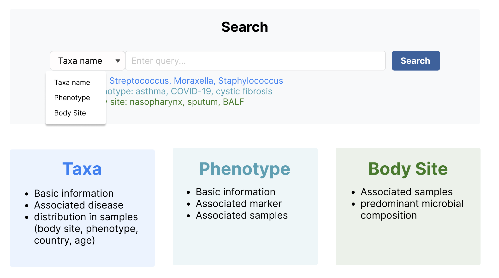
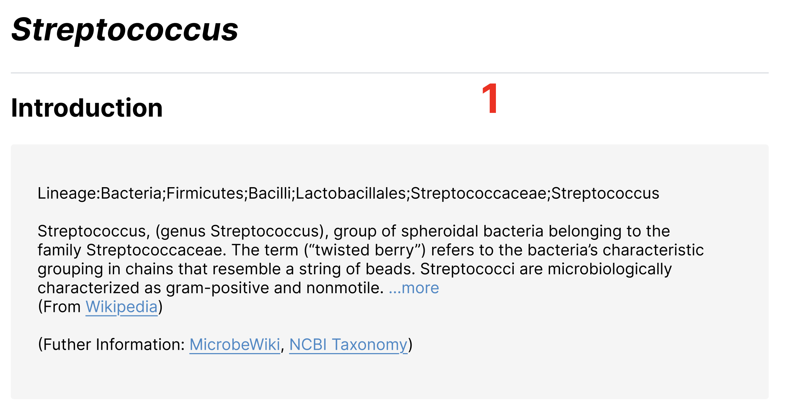
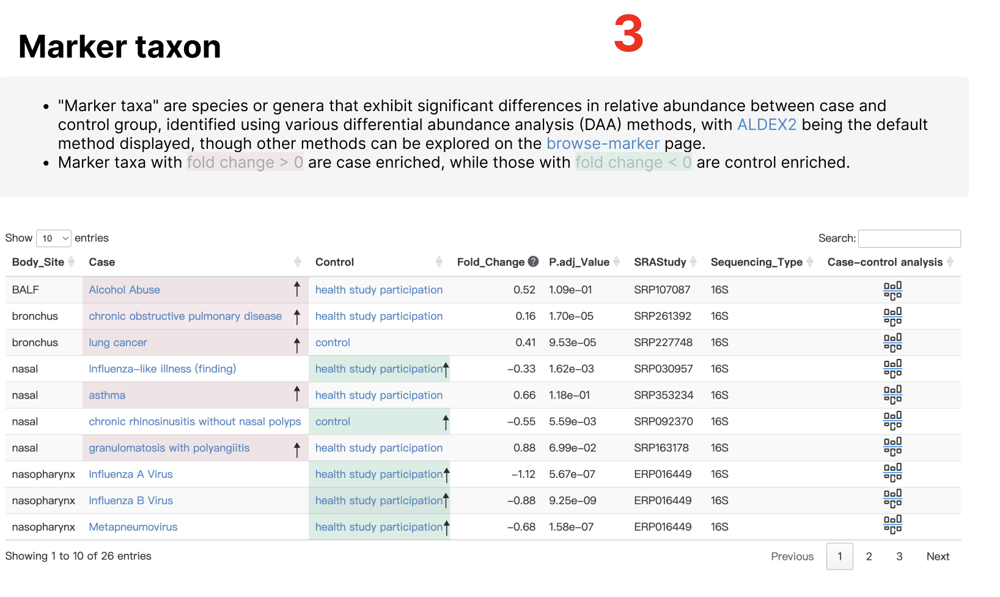
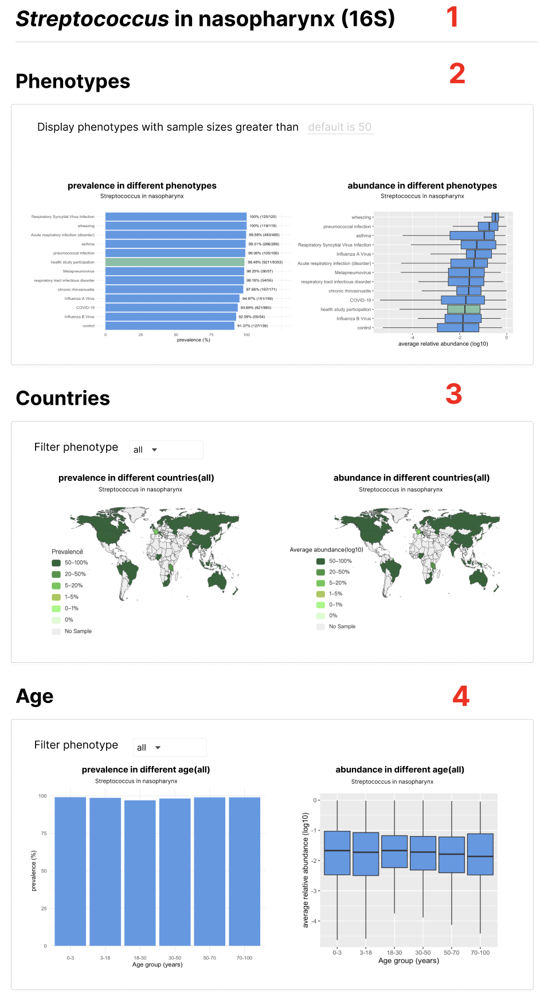

# Search

1. Taxa name，在data/taxa_intro.tsv的taxa列中检索。链接到`Search-{taxa}`。示例：Moraxella, Streptococcus, Staphylococcus。（注意斜体）
2. Phenotype，在data/phenotype.tsv的Phenotype列检索。链接到`Browse-phenotype-{disease}`。示例：asthma, COVID-19, cystic fibrosis
3. Body Site直接对应`Browse-body-sites`对应的部位。链接到`Browse-{body-sites}`。示例：nasopharynx, sputum, BALF

# Search-Streptococcus 

Streptococcus斜体

Introduction: Lineage后的信息，以及菌的介绍分别对应data/taxa_intro.tsv的lineage和info列（筛选taxa列为搜索的Streptococcus）,链接对应

Wikipedia: https://en.wikipedia.org/wiki/{taxa}

MicrobeWiki: https://microbewiki.kenyon.edu/index.php/{taxa}

NCBI Taxonomy: https://www.ncbi.nlm.nih.gov/taxonomy/?term={taxa}

Distribution in different body sites：对应data/Taxa_in_Body_Site.tsv（筛选taxa列为搜索的Streptococcus），第一列和第二列Visualization（图标居中）链接到`visulize-Streptococcus-nasopharynx`页面，图标在figure/Visualization.svg。数值填充颜色为#90C2FA。

**表格中的NA填充有bug**

文字部分：ALDEX2链接https://www.bioconductor.org/packages/release/bioc/html/ALDEx2.html。browse-marker链接到`browse-markers`页面,筛选Taxa列为Streptococcus。fold change>0背景染色#F9E8EC，fold change<0背景染色#D2EFE4，效果类似于https://gmrepo.humangut.info/phenotypes/comparisons/D006262/D000086382的最底部。

表格部分：

对应data/marker_taxon.tsv（筛选taxa列为搜索的Streptococcus）。

fc_sign为positive代表在Case组富集，对应Case列，染色#F9E8EC。fc_sign为negative代表在Control组富集，对应Control列，染色#D2EFE4。并且在染色的块后面加上箭头，强调富集的意思。

Fold_Change后面的问号解释内容为：the mean of the differences between 0.1-0.9 quantiles of the logarithmic in two groups.

Case和Control，链接到`Browse-phenotype-{disease}`页面。ase-control analysis列链接`Analysis-case-control-analysis`页面，图标在figure/case-control-analysis.svg。

# visulize-Streptococcus-nasopharynx

1. 标题对应`Search-taxa-Streptococcus `的Distribution in different body sites筛选的 `{taxa} in {Body_Site} ({Sequencing_Type})`。注意taxa斜体
2. Phenotypes

- 数据data/Taxa_in_Body_Site_of_Phenotype.tsv（筛选taxa列为搜索的Streptococcus）
- prevalence in different phenotypes的bar图对应prevalence列，label为prevalence_label列。Phenotype为health study participation颜色为#66c2a5，其他颜色为#4697ec。排序先按prevalence列降序，再按 num列降序。
- abundance in different phenotypes的boxplot图对应abu_min	abu_q1	abu_median	abu_q3	abu_max列。
- Display phenotypes with sample sizes greater than可以对num的个数进行筛选phenotype,默认num》50

3. Countries

- 数据data/Taxa_in_Body_Site_of_Countries.tsv（筛选taxa列为搜索的Streptococcus）
- Select phenotype对Phenotype列进行筛选（单选框，默认是Phenotype=="all"）
- 左右图对应relative_abundance	prevalence列，以连续的值展示。标题(all)里面的是筛选的对应的Phenotype。

4. Age

- 数据data/Taxa_in_Body_Site_of_Age.tsv（筛选taxa列为搜索的Streptococcus）
- Select phenotype对Phenotype列进行筛选（单选框，默认是Phenotype=="all"）
- prevalence in different age的bar图对应prevalence列。标题(all)里面的是筛选的对应的Phenotype。Age_Group注意顺序为c("0-3", "3-18", "18-30", "30-50", "50-70", "70-100")。
- abundance in different phenotypes的boxplot图对应abu_min	abu_q1	abu_median	abu_q3	abu_max列。标题和Age_Group顺序同上。